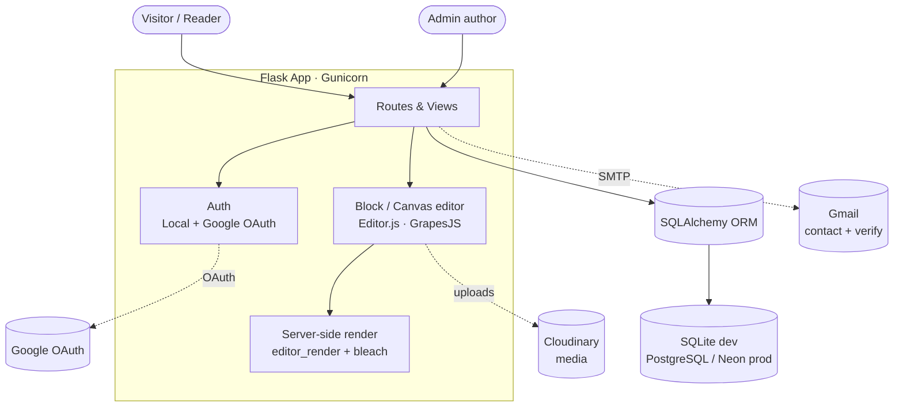

<div align="center">

# 🌊 Tarangeeta

### A full-featured Flask blogging CMS with block-based rich-text authoring, Cloudinary media, Google OAuth, and a scheduling-aware admin dashboard. तरंगीता — *where reflection begins and ripples follow.*

[](https://www.python.org/)
[](https://flask.palletsprojects.com/)
[](https://neon.tech/)
[](https://www.sqlalchemy.org/)
[](https://getbootstrap.com/)

**[Overview](#-overview) · [Features](#-features) · [How It Works](#-how-it-works) · [Tech Stack](#-tech-stack) · [Run Locally](#-run-locally) · [Deployment](#-deployment)**

</div>

<p align="center"></p>

---

## 🪷 Overview

**Tarangeeta** (तरंगीता) is a personal blogging platform built on Flask — part content-management system, part quiet space for reflection on spirituality, technology, and everything in between. It pairs a modern block-based writing experience with the practical machinery a real blog needs: authentication, media uploads, SEO, scheduling, comments, and an email-gated admin dashboard.

Content is authored in an **Editor.js** block editor (with a free-form GrapesJS "canvas" mode for designed layouts), stored as structured JSON, and server-rendered to clean, SEO-friendly, JavaScript-independent HTML on every request. The app runs on SQLite locally and PostgreSQL (Neon) in production, and ships ready to deploy on Render.

> **Note:** A Render deployment blueprint is included, but the public instance is currently offline. The screenshot above was captured from a local run.

---

## ✨ Features

| | |
|---|---|
| ✍️ **Block editor** | Editor.js-powered authoring with custom inline tools (colors, highlights, font sizing), autosave, cover images, and audio narration. |
| 🎨 **Canvas layouts** | Alternate GrapesJS "canvas" post type for fully designed, free-form pages, rendered inside a sandboxed iframe. |
| 🔐 **Dual auth** | Local email/password (pbkdf2 hashing) plus **Google OAuth** via Flask-Dance, with email verification for local sign-ups. |
| 🗂️ **Admin dashboard** | Email-gated CMS with status filters (published / draft / scheduled / archived), search, duplicate, and one-click status changes. |
| ⏱️ **Scheduling** | Publish now, save as draft, or schedule for later — scheduled posts go live on first read, no background worker required. |
| 🖼️ **Cloudinary media** | Image, video, and audio uploads; pasted stock-photo links are resolved to direct images and re-hosted automatically. |
| 🔎 **Discovery** | Categories, tags with slugs, full-text-style search, pagination, related posts, and auto-generated table of contents. |
| 📈 **SEO built in** | Slug URLs, per-post meta titles/descriptions, Open Graph images, canonical URLs, `sitemap.xml`, and `robots.txt`. |
| 💬 **Comments & contact** | Verified-user comments with Gravatar avatars, plus a contact form that stores messages and emails the admin. |
| 🛡️ **Security-minded** | Per-request CSP nonces, CSRF protection, HSTS in production, `ProxyFix`, secure cookies, and bleach HTML sanitization. |

---

## 🧩 How It Works

Posts are written as **Editor.js JSON** (the source of truth) and rendered to sanitized HTML on the server, so published pages stay fast and work without client-side JavaScript. Authentication supports both local accounts and Google OAuth, and the same code path runs on SQLite in development and PostgreSQL in production — legacy `postgres://` URLs are auto-normalized and missing columns are backfilled by a lightweight startup migration.



**Request lifecycle highlights**

- **Publish-on-read scheduling** — every listing view promotes any scheduled post whose time has arrived, so there is no cron job to run.
- **Slug-first URLs** — legacy numeric `/post/<id>` links `301`-redirect to canonical `/post/<slug>` URLs.
- **Defense in depth** — even though only the admin authors content, inline block HTML is passed through a strict bleach allowlist before storage.

---

## 🛠️ Tech Stack

| Layer | Technologies |
|---|---|
| **Backend** | Flask 3, SQLAlchemy 2.0, Flask-SQLAlchemy, Flask-Login, Flask-WTF |
| **Auth** | Google OAuth (Flask-Dance), pbkdf2 password hashing, email verification |
| **Editors** | Editor.js block editor, GrapesJS canvas layouts, Flask-CKEditor (legacy import) |
| **Content** | `editor_render` (JSON → HTML), bleach sanitization, reading-time & TOC extraction |
| **Media** | Cloudinary (images, video, audio narration) |
| **Frontend** | Bootstrap 5, Jinja2 templates, custom CSS |
| **Database** | SQLite (local) · PostgreSQL / Neon (production) |
| **Deployment** | Gunicorn, Render (`render.yaml` blueprint + `Procfile`), Python 3.12.7 |

---

## 🚀 Run Locally

**Prerequisites:** Python 3.12+

```bash
# Clone the repository
git clone https://github.com/dishasawantt/tarangeeta-blog.git
cd tarangeeta-blog

# Create a virtual environment
python -m venv venv
source venv/bin/activate        # Windows: venv\Scripts\activate

# Install dependencies
pip install -r requirements.txt

# Configure environment variables
cp .env.example .env            # then edit .env with your values
```

Run the development server:

```bash
python main.py
```

The app starts at **http://localhost:5001** using a local SQLite database. Google OAuth, Cloudinary uploads, and email are optional locally — the app degrades gracefully when those keys are absent.

### Environment variables

| Variable | Required | Description |
|---|---|---|
| `SECRET_KEY` | Yes (production) | Flask session secret |
| `ADMIN_EMAIL` | Yes | Email that unlocks the admin dashboard & messages |
| `DATABASE_URL` | No | PostgreSQL URL (defaults to local SQLite) |
| `GOOGLE_CLIENT_ID` / `GOOGLE_CLIENT_SECRET` | For OAuth | Google OAuth credentials |
| `CLOUDINARY_CLOUD_NAME` / `CLOUDINARY_API_KEY` / `CLOUDINARY_API_SECRET` | For media | Cloudinary uploads |
| `MAIL_ADDRESS` / `MAIL_APP_PASSWORD` | For email | Gmail address + App Password for SMTP |

---

## ☁️ Deployment

Tarangeeta is deployable on **Render + Neon** for $0/month. The repository includes a `render.yaml` blueprint, a `Procfile`, and a pinned `runtime.txt` (Python 3.12.7).

Production start command:

```bash
gunicorn main:app --bind 0.0.0.0:$PORT --workers 1
```

See **[DEPLOY.md](DEPLOY.md)** for the full step-by-step guide, including Neon setup, Google OAuth redirect URLs, Gmail App Passwords, and every environment variable.

---

<div align="center">

### Disha Sawant
**AI Application Engineer** · M.S. Computer Engineering @ SDSU

[](https://dishasawantt.github.io/resume)
[](https://linkedin.com/in/disha-sawant-7877b21b6)
[](https://github.com/dishasawantt)
[](mailto:dishasawantt@gmail.com)

</div>
